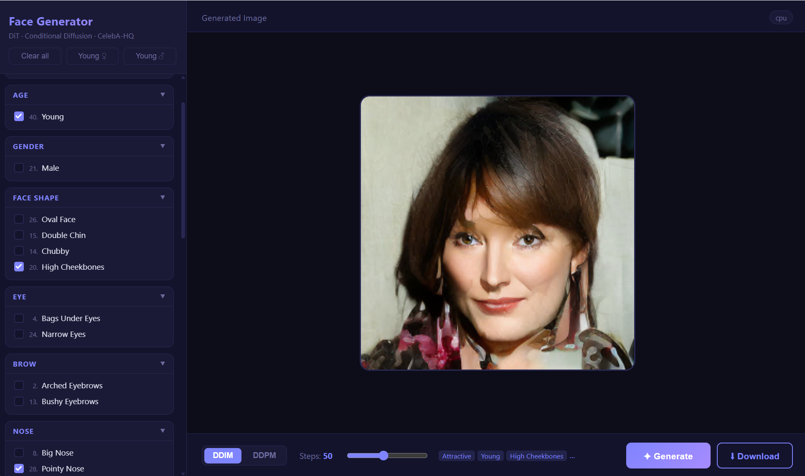
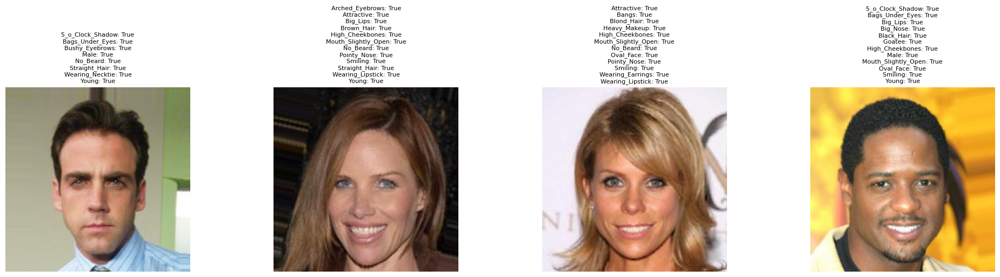
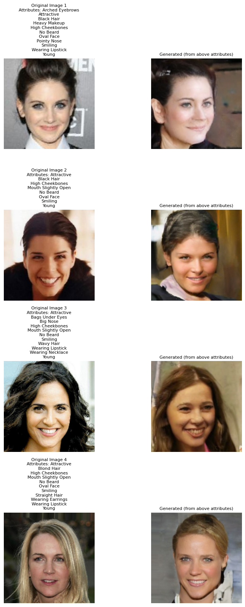
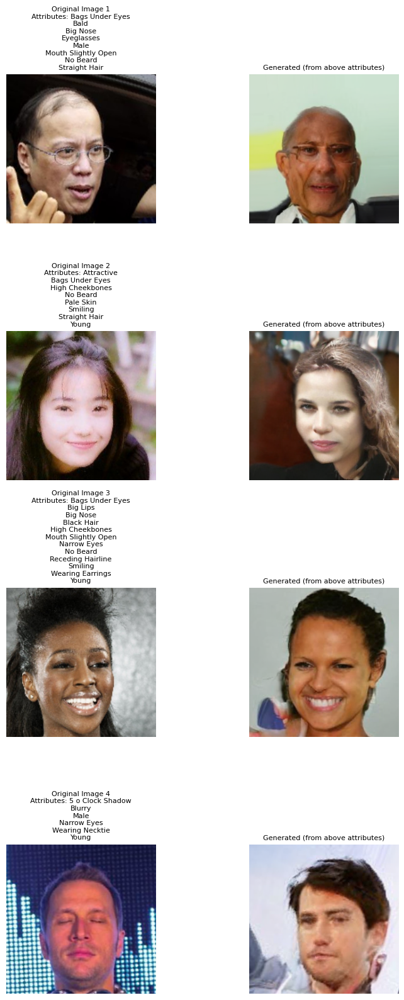
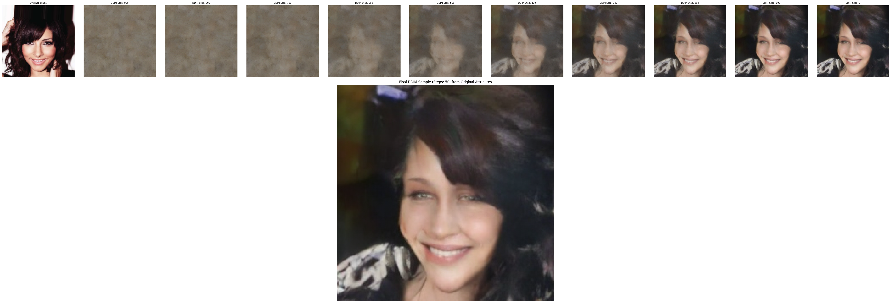
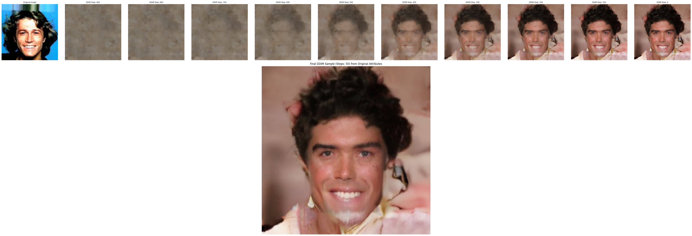

# FaceDial -- Fine-Grained Face Generation

Most image generation tools require you to write long, detailed text prompts to describe a face -- and even then, specific details like hair colour, beard style, or whether someone is wearing glasses are often ignored or inconsistent.

**FaceDial removes the guesswork.** Instead of writing prompts, you simply toggle the exact attributes you want. 40 facial attributes, 14 groups, one click per feature. No prompt engineering, no trial and error -- what you select is what you get.



## How It Works

The model is trained on CelebA-HQ with 40 binary facial attributes as conditioning signals. Each attribute is a direct control knob -- the generated face reflects your selection precisely.



## Source Code

[`face_generator.ipynb`](face_generator.ipynb) contains the full source code for:

- **Model architecture** -- DiT, VAE integration, attention modules
- **Training** -- dataset loading, noise scheduling, loss, checkpointing
- **Inference** -- DDPM and DDIM sampling, attribute-conditioned generation

The notebook is designed to run on Google Colab with GPU. It can also be used for local inference if you prefer working directly in a notebook rather than the web app.

**DDPM samples:**

| | |
|---|---|
|  |  |

**DDIM samples:**





## Model Architecture

### Overview

The pipeline combines a **Variational Autoencoder (VAE)** with a **Diffusion Transformer (DiT)**:

```
Attributes (40-dim binary vector)
       |
       v
[AttributeEmbedding MLP]
       |
       | cross-attention (every layer)
       v
Noise --> [VAE Encoder] --> Latent --> [DiT x24 layers] --> Denoised Latent --> [VAE Decoder] --> Image
                          (32x32x4)          ^
                                             | AdaLN (every layer)
                                    [Timestep Embedding]
```

- The VAE (`stabilityai/sd-vae-ft-mse`) compresses 256x256 images into 32x32x4 latents and decodes them back. The DiT never operates in pixel space.
- The DiT denoises the latent over T timesteps, guided by both the timestep and the attribute vector at every layer.

### Attribute Conditioning -- Cross-Attention

The 40 binary attribute values are first projected into a single embedding vector by a small MLP:

```
[0, 1, 0, 1, ..., 1]  (40-dim binary vector)
        |
   Linear(40 -> 3072)
        |
      GELU
        |
   Linear(3072 -> 768)
        |
   attr_token  (768-dim)
```

This attribute token acts as the **key and value** in a Cross-Attention block placed at the start of every transformer layer. Each of the 256 image patch tokens attends to this single attribute token, mixing attribute information into every spatial position at every layer of the network.

### Timestep Conditioning -- Adaptive Layer Norm (AdaLN)

The diffusion timestep is embedded via sinusoidal encoding and projected to 768 dims. In each layer this embedding is linearly projected to **6 vectors** -- pre-shift, pre-scale, and post-scale for both the self-attention and MLP sub-blocks. These modulate the layer norms, giving the model explicit control over each block's contribution at each noise level.

### Parameter Count

| Component | Parameters | Trainable |
|---|---|---|
| DiT (Diffusion Transformer) | 316.7M | Yes |
| &nbsp;&nbsp; Patch Embedding | 13K | Yes |
| &nbsp;&nbsp; Attribute Embedding MLP | 2.5M | Yes |
| &nbsp;&nbsp; Timestep Projection | 1.2M | Yes |
| &nbsp;&nbsp; 24 x Transformer Layer | 311.8M | Yes |
| &nbsp;&nbsp;&nbsp;&nbsp; Self-Attention (per layer) | 2.4M | Yes |
| &nbsp;&nbsp;&nbsp;&nbsp; Cross-Attention (per layer) | 2.4M | Yes |
| &nbsp;&nbsp;&nbsp;&nbsp; MLP (per layer) | 4.7M | Yes |
| &nbsp;&nbsp;&nbsp;&nbsp; AdaLN (per layer) | 3.5M | Yes |
| VAE Encoder + Decoder | ~84M | Frozen |
| **Total** | **~401M** | |

Only the DiT is trained. The VAE is frozen throughout and used purely for encoding images into latents and decoding generated latents back to pixels.

### Per-Layer Forward Pass

```
input x
  |
  |-- CrossNorm --> CrossAttention(x, attr_token) ----------> + x
  |
  |-- AttNorm --> AdaLN(shift, scale) --> SelfAttention --> x post_scale --> + x
  |
  `-- FFNorm  --> AdaLN(shift, scale) --> MLP -----------> x post_scale --> + x
```

Separating attribute conditioning (cross-attention) from timestep conditioning (AdaLN) lets the model independently control *what the face looks like* and *how aggressively to denoise at this step*.

## Deployment

This app is designed for **local CPU deployment** -- no GPU or cloud service required. The model runs entirely on your machine.

Expected generation times on CPU:
- **DDIM (50 steps):** ~3-8 minutes depending on your CPU
- **DDPM (1000 steps):** ~60-120 minutes -- not recommended on CPU

### GPU Acceleration (recommended)

If you have an NVIDIA GPU, install the CUDA version of PyTorch for dramatically faster generation (DDIM 50 steps in ~5-15 seconds):

```bash
# After creating and activating the conda environment:
pip install torch torchvision --index-url https://download.pytorch.org/whl/cu121
pip install -r requirements.txt
```

Replace `cu121` with your CUDA version (`cu118`, `cu124`, etc.). Check your version with `nvidia-smi`.

The app detects CUDA automatically -- no code changes needed. The device in use is shown in the top-right corner of the web interface.

## Setup

Run the following in **Anaconda Prompt** (search for it in the Start menu). Regular PowerShell/CMD will not have `conda` on PATH.

```bash
conda create -n face-gen python=3.11
conda activate face-gen
pip install -r requirements.txt
```

If you prefer PowerShell or CMD, use the full path to conda:

```powershell
C:\Users\wande\anaconda3\Scripts\conda.exe create -n face-gen python=3.11
C:\Users\wande\anaconda3\Scripts\conda.exe activate face-gen
pip install -r requirements.txt
```

## Model

The app loads the DiT model in this order:

1. **Local checkpoint** -- any `.pth` file inside the `checkpoint/` folder (highest epoch is used)
2. **HuggingFace** -- downloads automatically from [`wanderly0501/conditional-face-generator`](https://huggingface.co/wanderly0501/conditional-face-generator) if no local checkpoint is found

The VAE (`stabilityai/sd-vae-ft-mse`) is always downloaded from HuggingFace on first run and cached locally.

## Run

```bash
python app.py
```

Open **http://localhost:5000** in your browser.

> The first launch takes a minute while the VAE downloads and both models load into memory.

## Usage

1. Select facial attributes from the sidebar (grouped by category)
2. Choose a sampling method:
   - **DDIM** -- fast, adjustable steps (10-200, default 50)
   - **DDPM** -- full 1000-step denoising, higher quality but much slower
3. Click **Generate**
4. Click **Download** to save the result as `generated_face.png`

Use the **Young (female)** / **Young (male)** buttons for quick presets, or **Clear all** to reset.

## Attributes

40 CelebA binary attributes organized into 14 groups:

| Group | Attributes |
|---|---|
| Overall | Attractive, Blurry |
| Age | Young |
| Gender | Male |
| Face Shape | Oval Face, Double Chin, Chubby, High Cheekbones |
| Eye | Bags Under Eyes, Narrow Eyes |
| Brow | Arched Eyebrows, Bushy Eyebrows |
| Nose | Big Nose, Pointy Nose |
| Lip | Big Lips |
| Skin | Pale Skin, Rosy Cheeks |
| Hair | Black / Blond / Brown / Gray Hair, Bald, Straight / Wavy Hair, Bangs, Receding Hairline |
| Beard | 5 O'Clock Shadow, No Beard, Mustache, Sideburns, Goatee |
| Expression | Smiling, Mouth Slightly Open |
| Accessories | Wearing Earrings / Hat / Necklace / Necktie, Eyeglasses |
| Make Up | Wearing Lipstick, Heavy Makeup |
